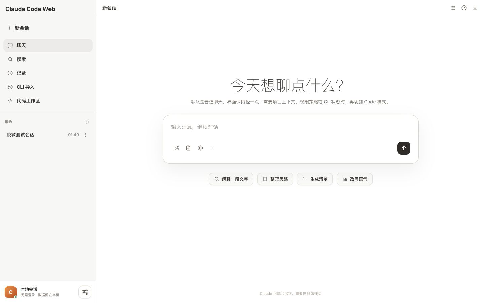
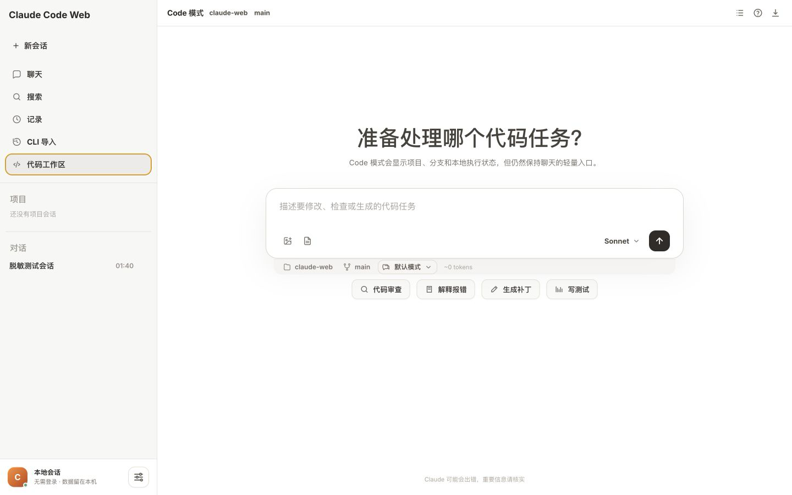
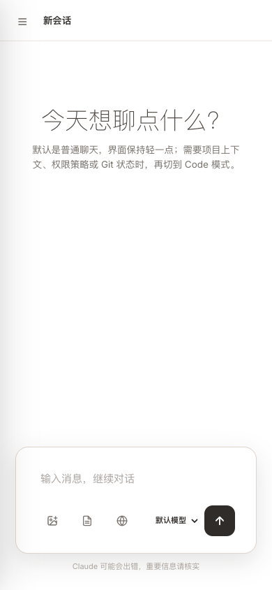
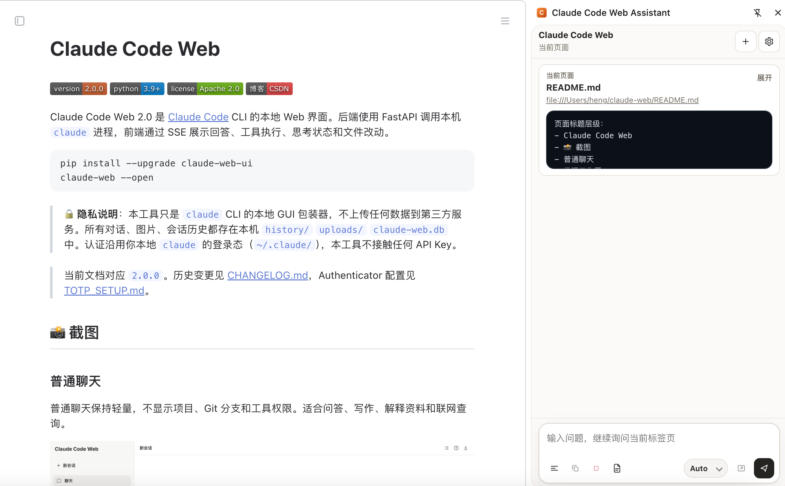

# Claude Code Web

[](https://github.com/heng1234/claude-web)
[](https://www.python.org/downloads/)
[](LICENSE)
[](https://blog.csdn.net/qq_39313596?type=blog)

Claude Code Web 2.0 是 [Claude Code](https://docs.claude.com/claude-code) CLI 的本地 Web 界面。后端使用 FastAPI 调用本机 `claude` 进程，前端通过 SSE 展示回答、工具执行、思考状态和文件改动。

```bash
pip install --upgrade claude-web-ui
claude-web --open
```

> 🔒 **隐私说明**：本工具只是 `claude` CLI 的本地 GUI 包装器，不上传任何数据到第三方服务。所有对话、图片、会话历史都存在本机 `history/` `uploads/` `claude-web.db` 中。认证沿用你本地 `claude` 的登录态（`~/.claude/`），本工具不接触任何 API Key。

> 当前文档对应 `2.0.2`。历史变更见 [CHANGELOG.md](CHANGELOG.md)，Authenticator 配置见 [TOTP_SETUP.md](TOTP_SETUP.md)。

## 📸 截图

### 普通聊天

普通聊天保持轻量，不显示项目、Git 分支和工具权限。适合问答、写作、解释资料和联网查询。



### 代码工作区

切换到「代码工作区」后才显示项目、Git 分支、运行模式、模型与推理强度、Token 上下文和代码快捷操作。



### 手机端

手机端使用抽屉导航和完整宽度的搜索浮层；输入框适配安全区，代码块、表格和工具结果支持窄屏滚动。



### 浏览器插件

Chrome MV3 Side Panel 支持读取当前页、选中文字右键提问，并把草稿转入完整 Claude Web 会话。



以上截图使用独立脱敏数据目录生成，不包含真实会话、完整本机路径、IP、Token、费用或账号信息。

## 2.0 核心变化

- **聊天 / Code 分层**：普通聊天隐藏项目开发上下文；Code 模式显示项目、分支、权限、模型、推理强度和本地执行状态。
- **全新侧栏**：聊天、搜索、记录、CLI 导入和代码工作区统一为列表式导航。
- **Codex 风格代码输出**：隐藏普通聊天反馈控件，集中展示计划、工具进度、文件改动和代码结果。
- **紧凑模型菜单**：主菜单只显示模型与推理强度，具体选项使用左右子菜单；窄屏会自动换边。
- **代码会话按项目归类**：项目绑定会话只出现在代码工作区，可在会话菜单中删除。
- **Code 权限体验**：代码工作区默认带全工具白名单，Bash、读写文件、搜索、Task 等 Claude Code 常用工具不再频繁卡在权限审批。
- **思考默认开启**：代码工作区默认开启思考过程并发送中等推理强度，可在设置中关闭或调整强度。
- **上下文可视化**：代码工作区按 1M 级上下文估算显示 Token 使用情况；不再自动压缩打断任务，必要时可手动输入 `/compact`。
- **文件改动摘要**：回答修改文件后显示文件列表，可打开查看 diff。
- **工具执行进度**：工具条展示执行数量、类型、完成度和运行状态。
- **手机端重构**：搜索浮层、侧栏抽屉、底部输入框、模态框和安全区统一优化。
- **设置中心**：通知、手机访问、浏览器插件、费用统计、记忆等配置集中管理。

## 主要能力

### 对话与输入

- 多轮对话、停止生成、会话分叉、历史消息编辑后继续。
- 图片粘贴 / 拖拽 / 上传，PDF、DOCX、PPTX、XLSX、CSV、TXT、MD 等文档文本提取。
- URL 正文抓取、WebSearch / WebFetch 联网搜索。
- `@` 文件引用和 Slash 命令：`/new`、`/clear`、`/fork`、`/compact`、`/init`、`/review`、`/test` 等。
- 草稿自动保存、Token 估算、长上下文提示和手动 `/compact` 压缩。
- Opus / Sonnet / Haiku 模型切换和低 / 中 / 高 / 极高推理强度。

### 代码工作区

- 项目、Git 分支和工作目录状态。
- 默认、规划、代理、自动四种运行模式；root / sudo 环境会自动改用 `acceptEdits + 工具白名单` 兼容 Claude CLI 的安全限制。
- Bash / Read / Write / Edit / Grep / Glob 等工具可视化。
- 工具进度条、工具详情折叠、思考过程默认展示、文件修改摘要和 diff 查看。
- Git checkpoint 与回滚（仅 Git 仓库）。
- 代码审查、解释报错、生成补丁和补充测试快捷入口。
- Agent Loop：按目标、轮数、Token 预算和测试命令持续执行、测试、修复和重试。

### 会话与本地数据

- 会话置顶、归档、标签、搜索、导出和 AI 命名。
- 普通聊天与项目绑定会话分区显示。
- 导入 `~/.claude/projects/` 中的 Claude Code CLI 会话，默认加载最近 10 条，继续滚动按需加载。
- 会话元数据存入 `claude-web.db`，事件存入 `history/*.jsonl`，附件存入 `uploads/`。
- 数据默认留在本机，沿用本机 Claude Code 登录状态，不读取或保存 Anthropic API Key。

### 渲染与通知

- Markdown、代码高亮、Mermaid、LaTeX、表格、引用和图片预览。
- Python / JavaScript / Bash 代码块可在确认后本机执行。
- 浏览器通知以及飞书、钉钉、企业微信、Slack、Discord、Telegram、自定义 Webhook。
- 使用统计和费用统计位于设置中心。

### 浏览器插件

- Chrome MV3 Side Panel。
- 读取当前页可见正文，或选中文字后右键解释、审查、改写和生成测试。
- 可将插件草稿转入完整 Web 会话。
- 插件 Token、目录和 ZIP 下载入口位于「设置 → 浏览器插件」。

## 快速开始

### 前置条件

1. Python 3.9+
2. 已安装并登录 Claude Code CLI

```bash
npm install -g @anthropic-ai/claude-code
claude
```

### pip 安装

```bash
pip install --upgrade claude-web-ui
claude-web
```

默认地址：`http://127.0.0.1:8765`

常用参数：

```bash
claude-web --open                 # 启动后打开浏览器
claude-web --port 9000            # 修改端口
claude-web --host 192.168.x.x     # 绑定明确的局域网地址
claude-web --extension-path       # 输出浏览器插件目录
claude-web --setup-totp           # 终端配置 Authenticator
claude-web --version              # 查看版本
```

### 源码运行

```bash
git clone https://github.com/heng1234/claude-web.git
cd claude-web
python3 -m venv .venv
source .venv/bin/activate
pip install -e .
claude-web --open
```

## 手机与远程访问

### 本机与可信私有网络

在「设置 → 手机访问」查看系统识别到的地址，并使用明确的局域网 IP 启动：

```bash
claude-web --host 192.168.x.x
```

然后在手机打开：

```text
http://192.168.x.x:8765
```

2.0.2 会把访问安全边界放在访问码 / Authenticator / 插件 Token 上；授权按钮和会话重试不再额外受 same-origin 严格匹配影响，避免 NAS、反向代理和移动浏览器壳误拦。回环地址、RFC1918 私网、链路本地地址及配置中的测试私网仍视为本地来源，不要求访问码或 Authenticator；普通公网来源必须验证。

### 公网访问

- 先在电脑端「设置 → 手机访问」启用访问控制。
- 可使用一次性 6 位访问码，或启用 Authenticator 动态验证码。
- 必须使用 HTTPS 反向代理，并设置登录限速。
- 不建议直接监听 `0.0.0.0`；优先绑定明确的私网地址或使用 ZeroTier / Tailscale 等私有网络。

详细步骤见 [TOTP_SETUP.md](TOTP_SETUP.md)。

## Chrome 插件安装

1. 启动 Claude Code Web。
2. 打开「设置 → 浏览器插件」。
3. 复制插件目录，或下载 ZIP 后解压。
4. 生成插件 Token。
5. 打开 `chrome://extensions`，启用开发者模式。
6. 加载已解压的扩展程序。
7. 在插件设置中填写服务地址和 Token。

更新插件代码后，需要在 `chrome://extensions` 点击「重新加载」，并刷新正在使用的网页。`chrome://`、Chrome Web Store 等受限页面无法读取正文。

## 安全边界

- Claude Code Web 可以读写本地文件、执行命令并消耗 Claude 配额，只应在可信设备上运行。
- 普通聊天不显示项目和分支，但仍由本机 Claude Code 处理；涉及代码修改时请切换到代码工作区。
- 代码块运行、Code 工作区工具白名单和自动模式没有系统级沙盒，不要执行不可信代码。
- Git checkpoint 仅在 Git 仓库中生效。
- Webhook 拒绝本地、私网和链路本地目标，避免 SSRF。
- 反向代理的转发头只在直连节点属于本地 / 私网代理时才会被信任。
- Authenticator Secret、插件 Token、访问码、Webhook Secret、数据库和 `history/` 不应提交到 Git。

提交前可运行：

```bash
python3 scripts/check_sensitive_info.py --paths \
  server.py static/index.html README.md CHANGELOG.md TOTP_SETUP.md
```

## 架构

```text
浏览器 / Chrome 插件
        │  HTTP + SSE
        ▼
FastAPI (Python)
        │  subprocess + stream-json
        ▼
Claude Code CLI
        │
        ├── claude-web.db        会话元数据、设置、费用、授权设备
        ├── history/*.jsonl      会话事件
        ├── uploads/             上传文件
        └── 本地项目 / Git       代码读取、修改、测试、checkpoint
```

前端仍为单页原生 JavaScript 应用，核心页面位于 `static/index.html`；pip 包使用 `claude_web/static/index.html`。

## 项目结构

```text
claude-web/
├── server.py
├── static/index.html
├── claude_web/
│   ├── server.py
│   └── static/index.html
├── browser-extension/
├── screenshots/
├── scripts/
├── README.md
├── CHANGELOG.md
└── TOTP_SETUP.md
```

## 已知限制

- Claude CLI 非交互流可能批量输出事件，前端打字机效果不代表模型原始 Token 速率。
- Code 工作区默认预放行 Claude Code 常用工具；仍建议只在可信项目中使用。
- 非 root 用户的自动模式会绕过 CLI 权限检查；root / sudo 环境会使用兼容放行，不会强行启用 Claude CLI 禁止的 bypass。
- 代码块执行无容器隔离。
- 浏览器插件不能读取浏览器受限页面。

## 开发与检查

```bash
pip install -e .
python3 scripts/check_sensitive_info.py --paths server.py static/index.html README.md
git diff --check
```

仓库包含 `.githooks/pre-commit`，可启用：

```bash
git config core.hooksPath .githooks
```

## 💬 交流群

扫码加入微信交流群（二维码 7 天有效，7 月 17 日前有效，过期请提 Issue 提醒）：


## 🤝 贡献

欢迎 Issue / PR。

## 👨‍💻 作者

**heng1234** · [CSDN 博客](https://blog.csdn.net/qq_39313596?type=blog)

## License

Apache License 2.0 — 见 [LICENSE](LICENSE)

## 致谢

- [Claude Code](https://docs.claude.com/claude-code)
- [FastAPI](https://fastapi.tiangolo.com/)
- [Tailwind CSS](https://tailwindcss.com/)
- [marked](https://github.com/markedjs/marked)
- [Mermaid](https://mermaid.js.org/)
