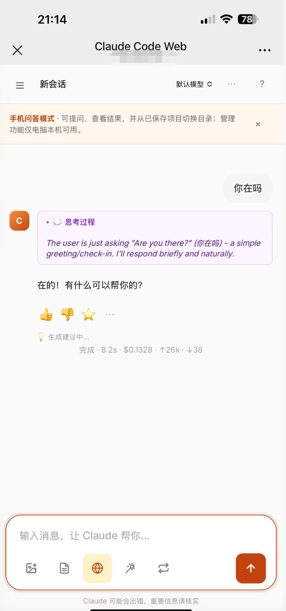

# Claude Code Web

[](https://pypi.org/project/claude-web-ui/)
[](https://www.python.org/downloads/)
[](LICENSE)
[](https://blog.csdn.net/qq_39313596?type=blog)

一个给 [Claude Code](https://docs.claude.com/claude-code) CLI 加可视化界面的 Web 应用。后端用 FastAPI 包装 `claude -p --output-format stream-json`，前端通过 SSE 流式渲染对话、工具调用、思考过程。

[更新日志](CHANGELOG.md) · [API 端点](#-api-端点速查) · [Roadmap](#-roadmap)

```bash
pip install claude-web-ui && claude-web
```

> 🔒 **隐私说明**：本工具只是 `claude` CLI 的本地 GUI 包装器，不上传任何数据到第三方服务。所有对话、图片、会话历史都存在本机 `history/` `uploads/` `claude-web.db` 中。认证沿用你本地 `claude` 的登录态（`~/.claude/`），本工具不接触任何 API Key。

## 📸 截图

### 主对话界面


### Token 级流式输出 & 工具调用可视化


### 手机访问问答模式


### Chrome MV3「选中即问」插件
点击插件图标即可打开 Chrome Side Panel；可读取当前页面全文，也可在网页选中文本或代码后右键让 Claude 解释、审查、改写或生成测试。


### 使用统计面板


### 暗黑模式


## ✨ 特性

### 💬 对话
- **Token 级流式输出**（打字机效果）
- 多轮对话（基于 `claude --resume`）
- 停止正在运行的任务
- **活跃会话保温**：每个会话保留一个持久 claude 进程，后续轮次跳过冷启动和 MCP 握手（无 MCP 省 1-2s，重度 MCP 用户省 5-15s/轮）
- **Agent Loop 自主工作模式**：给 Claude 一个目标、轮数和 token 预算，后端 job 会自动连续执行、测试、失败重试、修复，直到完成、阻塞、停止或预算用完
- **通知中心**：Agent Loop 完成 / 阻塞 / 出错、重复测试失败和版本更新可推送到飞书、钉钉、企业微信、Slack、Discord、Telegram Bot 或自定义 Webhook
- **手机访问问答模式**：同 WiFi 下可用本机局域网 IP + 6 位访问码在手机浏览器访问；设备授权有效期可自定义，手机端只保留问答、查看结果和切换已保存项目等低风险操作
- **跟进建议**：回答后自动生成 3 个「你可能想继续问」的追问按钮
- **会话分叉**：基于任意历史消息编辑 / 重新生成，原会话保留
- **思考动画**：等待响应时用跳动圆点 + 扫光文字提示

### 📝 输入
- 文本 + 图片（**文件选择 / 粘贴 / 拖拽**），同一图片不会重复上传
- **Chrome 当前页面 / 选中即问插件**：点击扩展图标打开 Side Panel，点「读取当前页」把整页可见正文带给 Claude；也可右键选中代码/文字提问，并一键转入完整 Web 会话
- 待发送图片缩略图**点击放大预览**，确认上传内容
- **文档上传**：PDF / DOCX / XLSX / XLS / CSV / TSV / TXT / MD / JSON / LOG 自动提取文本作为上下文
- **URL 自动检测**：输入框里粘贴链接，发送时自动抓取网页正文
- **联网搜索开关**：一键激活 WebSearch / WebFetch
- `@` 引用工作目录下的文件（↑↓ 选择）
- **Slash 命令菜单**：输入 `/` 弹出操作、重操作、内置模板和个人模板分组，支持 ↑↓ / Tab / Enter / Esc
- **会话操作命令**：`/new` 新建、`/clear` 清空当前会话、`/fork` 从最后一条用户消息分叉
- **重操作命令**：`/compact` 用 Haiku 压缩旧历史并备份 JSONL，`/init` 扫描项目生成 `CLAUDE.md` 草稿到输入框
- **内置模板命令**：`/recap` `/test` `/explain` `/review` `/refactor` `/commit` `/docs`
- **自定义 Slash 模板**：提示词模板可设置 `slash_trigger`，显示在「我的模板」分组
- **Prompt 优化器**：基于本地黄金样本库、好评 / 收藏候选和个人任务规则，生成轻度优化 / 专家模式 / 探索模式三档改写
- **本地优先的 Prompt 规则沉淀**：按代码审查、Debug、产品方案、写作等任务类型自动分类，沉淀个人偏好规则，并在改写时解释用了哪些规则和相似样本
- Token 估算 + 草稿自动保存
- 提示词模板库（支持普通插入和 Slash 触发）

### 🎨 渲染
- Markdown + 代码高亮（highlight.js）
- 工具调用图标化（Bash / Read / Write / Edit 等）
- **Edit 工具并排 diff**
- **Mermaid** 图表 + **LaTeX** 公式
- **代码块一键运行**：Python / JavaScript / Bash 现场执行，输出嵌在对话里
- 图片 Lightbox（点击放大）
- 代码块 / 全文一键复制
- **滚动控制**：流式输出中手动往上滚不被打断，右下角浮动「跳到最新 ↓」按钮带新内容计数

### 🗂 会话管理
- 📌 置顶 / 📥 归档 / 🏷 标签
- **里程碑标记**：用户消息和 Claude 回答都可点 ⭐，左侧「标记」Tab 只展示关键轮次并可一键滚动回原消息
- **CLI 会话 Tab**：侧栏可直接切到「CLI」查看 `~/.claude/projects/` 历史，会话标题优先显示真实用户消息，跳过 hook 注入噪音
- 🪄 AI 智能命名（让 Claude 给会话起标题）
- 双击标题重命名
- 搜索（标题 + 内容）
- 导出为 Markdown
- 会话 token 累计展示，长上下文时提示可用 `/compact` 降低后续成本

### 🛡 安全 & 回滚
- **权限策略**：自由 / 允许编辑 / 计划 / 只读 / 自定义工具列表
- **工具权限重试**：当 Claude 因权限不足无法使用工具时，UI 弹出提示卡片，支持一键放行工具并重试本轮（无需切到 CLI）
- **Git Checkpoint**：每轮对话前自动 `git stash create` 快照，一键回滚文件
- **编辑 / 重新生成**：基于任意历史消息分叉新会话
- **SSRF 防护**：URL 抓取拒绝私网 / 本地主机
- **移动访问安全**：手机访问必须通过本机生成的访问码授权；通知 Webhook 拒绝本地 / 私网 / 链路本地目标，反向代理 HTTPS 场景下 cookie 会正确设置 Secure 标记

### 📋 TodoWrite 实时看板
- Claude 调用 TodoWrite 时右上角弹出任务面板
- 进度条 + 逐项状态（⬜ 待办 / ⏳ 进行中 / ✅ 完成）
- 多次 TodoWrite 调用自动队列回放，进度动画
- 面板可折叠 / 关闭

### 🔌 MCP Server 管理面板
- 可视化查看所有 MCP server（支持 user / local / project 三层 scope）
- 一键启用 / 禁用 / 删除
- 添加新 server（表单引导，支持 stdio 类型）
- 环境变量 / headers 自动脱敏显示（token/key/secret 只显示前 4 位）
- 支持 `.mcp.json` 项目级配置
- 修改后新建会话即生效

### 🎓 上手 & 引导
- **首次启动 5 步交互引导**：高亮 UI 控件 + 浮层 tooltip，半分钟学会主功能
- **版本更新提醒**：启动后会轻量检查 PyPI 最新版，发现新版时右下角提示并可一键复制升级命令；已升级到新版本后会显示 What's New
- **帮助面板（顶栏 `?`）**：快捷键速查 / 使用技巧 / 完整更新日志 / 一键重看引导
- **新会话空状态**：4 张示例 prompt 卡片（代码审查 / 技术解释 / 写工具 / Mermaid）一键填入
- **移动端优化**：手机上侧栏为抽屉式导航，底部输入区适配 iPhone safe area，代码块 / 工具结果 / Edit Diff 针对窄屏做滚动和上下布局

### 📊 其它
- 模型切换（Opus / Sonnet / Haiku）
- 使用统计（总成本 / 每日成本柱图 / 工具使用排行）
- Git 状态栏（branch / dirty 文件数）
- 系统提示词自定义
- 暗黑模式
- 快捷键：`⌘K` 搜索 · `⌘N` 新会话 · `Esc` 关闭弹窗 / 引导 / 弹窗
- 浏览器通知 + 完成提示音
- 移动端响应式（侧栏抽屉、手机问答模式、窄屏代码块优化）
- IME 输入法兼容（中文拼音回车不误发）

---

## 🚀 快速开始

### 前置条件

1. **已安装 [Claude Code CLI](https://docs.claude.com/claude-code/quickstart)**：
   ```bash
   npm install -g @anthropic-ai/claude-code
   claude  # 首次登录
   ```
2. **Python 3.9+**

### 安装

#### 方式一：pip 安装（推荐）

```bash
pip install claude-web-ui
```

安装完成后一条命令启动：

```bash
claude-web
# 浏览器打开 http://127.0.0.1:8765
```

更新到最新版：

```bash
pip install --upgrade claude-web-ui
```

#### 方式二：让 Claude Code 自己装 🎉

```bash
claude
```

进入交互模式后，把下面这段话丢给它：

```
帮我安装 claude-web-ui：pip install claude-web-ui，然后运行 claude-web 启动服务
```

> 💡 用 Claude Code 给 Claude Code 装一个 Web UI。

#### 方式三：从源码安装

```bash
git clone https://github.com/heng1234/claude-web.git
cd claude-web
pip install -e .
claude-web
```

### 运行

```bash
claude-web                    # 默认 127.0.0.1:8765
claude-web --port 9000        # 自定义端口
claude-web --open             # 启动后自动打开浏览器
```

### 手机访问（同 WiFi + 访问码）

Claude Web 能读本地文件、执行命令并消耗 Claude quota。手机访问默认建议只在可信同 WiFi 下使用，并始终开启访问码。

电脑端打开「设置 → 手机访问」后，会自动识别本机局域网 IP，并给出推荐启动命令和手机访问地址：

```bash
claude-web --host <本机局域网 IP>
```

手机打开：

```text
http://<本机局域网 IP>:8765
```

首次访问时，在电脑端「设置 → 手机访问」里开启功能并生成 6 位访问码；手机输入访问码后，会按你选择的有效期保持授权，到期自动重新验证。

出门远程使用时，可以选择 ZeroTier 等私有网络工具，让电脑和手机处在同一个私有网络里，再绑定对应的私有 IP。

不建议把服务直接暴露到公网，也不建议在公司、酒店、咖啡店等公共网络使用 `0.0.0.0`。

⚠️ `0.0.0.0` 会让所有可达网卡都监听服务；即使开启了手机访问码，也更推荐绑定一个明确的本机 IP。

### 自定义端口

```bash
PORT=9000 python server.py
```

### 多窗口并行对话

直接在新浏览器标签页 / 窗口打开 `http://127.0.0.1:8765`，点「＋ 新会话」即可并行对话。每个标签页独立，互不干扰。

### Agent Loop 自主工作

点击输入框工具栏的循环按钮打开 Agent Loop，填写目标、最多轮数、token 预算和可选测试命令。后端会创建一个 Agent Loop job，连续驱动 Claude 按“执行 → 测试 → 修复 → 再验证”的节奏迭代，直到 Claude 在回复末尾输出 `AGENT_LOOP_DONE`、`AGENT_LOOP_BLOCKED`，或达到停止 / 预算 / 轮数上限。运行中刷新页面或重新打开同一会话时，前端会恢复订阅仍在运行的 job。

适合这类任务：

- “实现这个小功能并跑相关测试”
- “修复当前报错，直到检查通过”
- “审查这组改动，能修的直接修，最后总结”

如果填写了测试命令，后端会在每轮 Claude 回复后自动运行该命令，把退出码、stdout、stderr 喂给下一轮 Claude；如果留空，会按 `package.json`、`Makefile`、Python 项目标记自动检测常见测试命令。单轮 Claude 调用失败会最多自动重试 2 次，连续 3 次遇到相同测试失败会暂停并提示人工介入。运行期间输入框会显示状态条，可随时点「停止」。勾选浏览器通知后，完成、阻塞或达到预算时会弹系统通知。

### 通知中心 / Webhook

打开「设置 → 通知渠道」即可启用远端通知。当前内置：

- 飞书群机器人
- 钉钉自定义机器人
- 企业微信群机器人
- Slack Incoming Webhook
- Discord Webhook
- Telegram Bot（Bot Token + Chat ID）
- 自定义 Webhook

每个渠道都可以独立启用、选择事件、发送测试通知，并查看最近 20 条发送记录。默认事件包含 Agent Loop 完成、阻塞、重复失败、出错和版本更新；聊天错误可手动勾选。自定义 Webhook 会收到标准 JSON payload，并可用 Secret 生成 `X-Claude-Web-Signature: sha256=...` 签名；飞书和钉钉 Secret 会按各自机器人签名规则发送。

### Chrome 插件：当前页面 / 选中即问

插件目前按 Chrome 开发者模式安装。`pip install claude-web-ui` 的用户不需要找源码仓库，Claude Web 设置页会直接显示插件目录，也可以下载 ZIP。

1. 启动 `claude-web`，打开 `http://127.0.0.1:8765`。
2. 打开 Claude Web「设置」里的「浏览器插件」区域。
3. 复制页面显示的插件目录，或点击「下载 ZIP」后解压。
4. 在 Claude Web「设置」里点击「生成 Token」，复制生成的一次性 Token。
5. 打开 Chrome `chrome://extensions`，开启「开发者模式」。
6. 点击「加载已解压的扩展程序」，选择插件目录或 ZIP 解压后的目录。
7. 打开插件设置页，填写服务地址、Token、默认工作目录和权限模式。
8. 点击浏览器工具栏的 `Claude Code Web` 图标打开 Side Panel，或在任意网页选中代码/文字后右键选择解释、审查、改写或生成测试。
9. 在 Side Panel 里点「读取当前页」可把当前标签页的可见正文作为上下文，再输入问题发送。

命令行也可以直接查看 pip 包里的插件目录：

```bash
claude-web --extension-path
# 或
claude-web-extension-path
```

源码开发时，插件目录仍然是仓库根部的 `browser-extension/`。

如果更新了插件代码，需要到 Chrome `chrome://extensions` 点一次「重新加载」，再刷新正在测试的网页。读取当前页依赖 Chrome 的 `scripting` 权限；如果提示页面读取权限未生效，通常重新加载扩展即可。

插件默认在 Chrome Side Panel 里显示流式回答；需要长对话或查看历史时，点「在 Claude Web 中继续」会打开同一个会话。插件入口只支持 `default` / `plan` / `readonly` 三种权限模式，不会从插件侧启用 `bypassPermissions`。

#### 常见问题

- 点击图标没有打开侧栏：先确认 Chrome 支持 Side Panel，并到 `chrome://extensions` 重新加载插件。
- 右键后没有反应：先到 `chrome://extensions` 重新加载插件，然后刷新当前网页再试。
- 读取当前页失败：`chrome://`、Chrome Web Store 等受限页面无法读取；普通网页若提示权限未生效，重新加载扩展后再试。
- 侧边栏提示未配置 Token：在 Claude Web 设置里重新生成 Token，粘贴到插件设置页并保存。
- 测试连接失败：确认 `claude-web` 正在运行，插件服务地址和 Web 页面端口一致，例如 `http://127.0.0.1:8765`。
- pip 用户找不到目录：在 Web 设置页复制「插件目录」，或者运行 `claude-web --extension-path`。

---

## 🔐 提交前敏感信息检查

仓库内置了 `.githooks/pre-commit`，会在 `git commit` 前扫描**已暂存文件**，重点拦截：

- 私钥块
- 常见平台 Token / API Key 模式
- 新增行里的 `api_key` / `token` / `password` / `secret` 这类疑似敏感赋值

首次 clone 后执行一次：

```bash
git config core.hooksPath .githooks
```

手动检查当前文件也可以：

```bash
python3 scripts/check_sensitive_info.py --paths server.py static/index.html README.md
```

如果 hook 拦截了提交，先用 `git diff --cached` 看暂存内容，再决定是否移除或替换敏感信息。

---

## 🧩 技术栈

| 层 | 技术 |
|---|---|
| 后端 | Python 3.9+ · FastAPI · uvicorn · SQLite · pypdf · python-docx · openpyxl · xlrd |
| 前端 | 原生 JS · TailwindCSS · marked.js · highlight.js · Mermaid · KaTeX · Chart.js |
| 协议 | Server-Sent Events（流式输出）· stream-json stdin（多模态图片输入） |
| 依赖 | `claude` CLI（透过 subprocess 调用） |

## 📐 架构

```
浏览器 ──POST /api/chat──> FastAPI
                            └─ subprocess: claude -p [message | --input-format stream-json] \
                                           --output-format stream-json \
                                           --include-partial-messages \
                                           [--session-id | --resume] \
                                           [--permission-mode | --allowed-tools]
                               └─ stdout JSON lines ──SSE──> 浏览器渲染
```

- 会话 ID 首轮前端生成 UUID 通过 `--session-id` 传入，后续用 `--resume`
- `--include-partial-messages` 开启 token 级流式
- **图片输入**走 `--input-format stream-json` + stdin，base64 内联（跟 Anthropic API 多模态格式一致），而非通过 Read 工具间接读取，避免精度损失
- 每轮对话前若 cwd 是 git 仓库，执行 `git stash create` 创建 checkpoint
- 会话元数据存 SQLite（`claude-web.db`），事件流存 JSONL（`history/{session_id}.jsonl`）

---

## 📁 项目结构

```
claude-web/
├── server.py              # FastAPI 主服务
├── browser-extension/     # Chrome MV3 选中即问插件
├── static/
│   └── index.html         # 单页前端
├── requirements.txt
├── screenshots/           # README 使用的截图
├── history/               # 会话事件 JSONL（运行时生成，gitignore）
├── uploads/               # 上传的图片/文档（运行时生成，gitignore）
├── claude-web.db          # SQLite 会话元数据（运行时生成，gitignore）
└── .venv/                 # 虚拟环境（gitignore）
```

---

## 🧰 API 端点速查

| 端点 | 方法 | 说明 |
|------|------|------|
| `/api/chat` | POST | 主对话，SSE 流式返回 |
| `/api/chat/stop/{session_id}` | POST | 停止正在运行的会话 |
| `/api/agent-loop/start` | POST | 启动后端 Agent Loop job（目标、轮数、token 预算、可选测试命令） |
| `/api/agent-loop/active` | GET | 查询当前仍在运行的 Agent Loop job，可按 `session_id` 过滤 |
| `/api/agent-loop/{job_id}/stream` | GET | 订阅 Agent Loop job 事件流，包含 Claude chat 事件和测试结果；可用 `from` 跳过已收到事件 |
| `/api/agent-loop/{job_id}/stop` | POST | 请求停止 Agent Loop job、当前 Claude turn 和正在运行的测试命令 |
| `/api/notifications/settings` | GET/PUT | 读取 / 保存通知中心配置（飞书、钉钉、企业微信、Slack、Discord、Telegram Bot、自定义 Webhook） |
| `/api/notifications/test` | POST | 向指定通知渠道发送测试消息 |
| `/api/notifications/deliveries` | GET | 查看最近 20 条通知发送记录 |
| `/api/extension/status` | GET | Chrome 插件检测服务和 token 状态 |
| `/api/extension/token` | POST | 生成 / 重置浏览器插件 token |
| `/api/extension/ask` | POST | 插件选中即问，SSE 流式返回并写入会话历史 |
| `/api/extension/stop/{session_id}` | POST | 停止插件侧正在运行的会话 |
| `/api/extension/drafts` | POST | 创建插件草稿并返回 Claude Web 打开链接 |
| `/api/extension/drafts/{id}` | GET | Claude Web 读取插件草稿并自动填入 / 发送 |
| `/api/prompt-optimizer` | GET | Prompt 优化器仪表盘：样本、规则、好评 / 收藏候选 |
| `/api/prompt-optimizer/samples` | POST/DELETE | 手动维护黄金样本 |
| `/api/prompt-optimizer/samples/from-session` | POST | 从当前会话或候选会话加入黄金样本 |
| `/api/prompt-optimizer/rules/{id}` | PATCH | 启用 / 关闭个人 Prompt 规则 |
| `/api/prompt-optimizer/rewrite` | POST | 生成轻度 / 专家 / 探索三档 Prompt 改写 |
| `/api/prompt-optimizer/feedback` | POST | 记录复制 / 采用改写结果的反馈 |
| `/api/upload` | POST | 上传图片 |
| `/api/upload-doc` | POST | 上传文档（PDF / DOCX / XLSX / XLS / CSV / TSV / TXT / MD / JSON / LOG），自动提取文本 |
| `/api/exec-code` | POST | 运行代码块（Python/JS/Bash，15s 超时） |
| `/api/fetch-url` | POST | 抓取 URL 正文（带 SSRF 防护） |
| `/api/sessions` | GET | 列出所有会话（含搜索 / 归档 / 标签） |
| `/api/sessions/search` | GET | 搜索会话（`@` 引用用） |
| `/api/sessions/{id}` | GET/PATCH/DELETE | 查看 / 修改 / 删除会话 |
| `/api/sessions/{id}/clear` | POST | 清空当前会话历史，保留本地 session id |
| `/api/sessions/{id}/compact` | POST | 用 Haiku 压缩旧历史，备份原 JSONL 并重置远端会话缓存 |
| `/api/sessions/{id}/export` | GET | 导出 Markdown |
| `/api/sessions/{id}/milestones` | GET | 当前会话 ⭐ 里程碑标记列表 |
| `/api/sessions/{id}/usage` | GET | 查看当前会话 token / 成本累计 |
| `/api/sessions/{id}/mention` | GET | 把会话内容整理成可引用上下文 |
| `/api/sessions/{id}/prepare-fork` | POST | 创建分叉会话 |
| `/api/sessions/{id}/prepare-inline-edit` | POST | 就地编辑历史消息并从该轮继续 |
| `/api/sessions/{id}/restore-checkpoint` | POST | Git 回滚 |
| `/api/sessions/{id}/suggest-title` | POST | AI 智能命名 |
| `/api/suggest-followups` | POST | 生成跟进建议 |
| `/api/prompts` | GET/POST/PUT/DELETE | 提示词模板 CRUD |
| `/api/prompts/search` | GET | 搜索提示词模板（`@` 引用和 Slash 自定义模板用） |
| `/api/projects/scan` | POST | 扫描项目关键文件和目录结构，供 `/init` 生成 `CLAUDE.md` 草稿 |
| `/api/memories` | GET/POST/PUT/DELETE | 持久记忆 CRUD（全局 / 项目 / 会话 scope） |
| `/api/memories/active` | GET | 查看当前 cwd / session 生效的记忆 |
| `/api/memories/search` | GET | 搜索记忆（`@` 引用用） |
| `/api/stats` | GET | 使用统计（成本 / 工具 / 每日） |
| `/api/git` | GET | 当前目录 git 状态 |
| `/api/files` | GET | 当前目录文件列表（@ 引用用） |
| `/api/cwds` | GET | 最近用过的工作目录 |
| `/api/tags` | GET | 所有标签统计 |
| `/api/mcp/servers` | GET | 列出所有 MCP server（含 disabled / 多 scope） |
| `/api/mcp/servers/{name}` | POST/PATCH/DELETE | 新增 / 修改 / 删除 MCP server |
| `/api/version` | GET | 当前后端版本（前端用于检测升级） |
| `/api/update-check` | GET | 检查 PyPI 最新版本，返回是否有新版和升级命令（失败静默缓存） |
| `/changelog.json` | GET | 更新日志（用于 What's New 弹窗 + 帮助面板） |

---

## ⚠️ 已知限制

- **权限审批是"失败后重试"模式**：不是 Cursor 那种执行中实时弹窗。当 Claude 因权限被拒时，UI 会显示琥珀色提示卡片，用户点击「允许 xxx 并重试」后系统自动把工具加入白名单并重发本轮。体验上多等一轮（20-30 秒），但功能完整。真正的实时交互审批需自建 MCP 权限服务器或双向 stream-json 通信。
- **Checkpoint 仅限 git 仓库**：非 git 目录跳过（后续可加 tar 快照）。
- **分叉会话会打包上下文**：编辑/重新生成时把历史作为前缀发给 Claude（可能多消耗 token）。
- **`/compact` 会调用模型**：压缩会话历史会额外调用一次 Haiku；原历史会备份到 `history/{sid}.before-compact-*.jsonl`，并自动清理旧备份。
- **`/init` 不直接写文件**：只把 `CLAUDE.md` 草稿 prompt 填入输入框，发送后由用户审阅再决定是否写入项目。
- **无鉴权**：仅供本地使用，不建议直接暴露公网。
- **代码块运行无沙盒**：Python/JS/Bash 直接在本机跑，点运行前会二次确认。
- **Claude CLI `-p` 模式流式局限**：CLI 在非交互模式下会整段缓冲后一次性吐事件，token 流式是"视觉动画模拟"，非真实 token 速率。

---

## 🗺 Roadmap

### 当前实现情况

#### 已实现 ✅
- [x] 多轮对话、停止生成、图片输入、工具调用可视化、思考过程展示
- [x] 文档上传（PDF / DOCX / XLSX / XLS / CSV / TSV / TXT / MD / JSON / LOG）和 URL 自动抓取上下文
- [x] 联网搜索开关、`@` 文件 / 会话 / 提示词 / 记忆引用、Token 估算、草稿自动保存、提示词模板库
- [x] Slash 命令菜单（`/new` `/clear` `/fork` `/compact` `/init` + 内置 / 自定义模板）
- [x] Agent Loop 自主工作模式（后端 job、目标 + 轮数 + token 预算、自动执行 / 测试 / 修复、失败重试、重复失败暂停、测试命令自动检测、可停止和完成通知）
- [x] 手机访问问答模式（同 WiFi + 指定本机 IP + 访问码、设备授权有效期、手机端高风险管理操作降级）
- [x] 移动端体验优化（侧栏 off-canvas 抽屉、safe area 输入区、900px 顶栏收纳、窄屏代码 / 工具 / Diff 适配）
- [x] Prompt 优化器（本地黄金样本库、按任务类型沉淀个人规则、相似成功样本、三档改写、一键采用）
- [x] Chrome 当前页面 / 选中即问插件（点击图标打开 Side Panel、读取当前页、右键解释 / 审查 / 改写 / 生成测试，可转入完整 Web 会话）
- [x] Mermaid / LaTeX 渲染、图片 Lightbox、代码块复制与本地运行
- [x] 会话置顶 / 归档 / 标签 / 搜索 / 导出 / 双击重命名 / AI 智能命名
- [x] 长会话里程碑标记（用户消息 / 回答点 ⭐，左侧「标记」Tab 快速回看关键轮次）
- [x] 历史消息就地编辑继续、重新生成分叉、Git checkpoint 回滚
- [x] TodoWrite 实时看板、统计面板、Git 状态栏、暗黑模式、移动端侧栏
- [x] 权限策略（CLI 默认 / 允许编辑 / 计划 / 只读 / 自定义工具）和权限失败后的本会话临时放行重试
- [x] MCP Server 管理面板（多 scope 查看 / 启用 / 禁用 / 添加 / 删除 / 脱敏展示）
- [x] **首次启动 5 步交互引导 + What's New 升级提醒 + 帮助面板（含完整更新日志）**
- [x] **稳定性硬化：SQLite WAL / SSE 断开清理子进程 / stderr 并发 drain / JSONL 原子写 / SIGTERM+SIGKILL 兜底**
- [x] **活跃会话保温（Warm Process Pool）：持久 claude 进程复用，后续轮次跳过冷启动和 MCP 握手，空闲 90s 自动回收**
- [x] **启动检测 claude CLI、`--host` 非 localhost 警告、`uploads/` 自动清理 > 30 天文件**
- [x] PyPI 发包（`pip install claude-web-ui`）

#### 部分实现 / 有限制 ⚠️
- [ ] 运行时交互式权限审批仍未实现；目前是预设策略 + 权限失败后重试
- [ ] 真正按模型原始速率的 token 级流式输出仍受 Claude CLI `-p` 模式限制
- [ ] Git checkpoint / 回滚仅适用于 git 仓库
- [ ] 代码块运行已实现，但无沙盒，只适合本机可信代码

### 待办
- [ ] Artifacts 侧边预览（HTML/React 实时渲染）
- [ ] 导入 `~/.claude/projects/` 原生会话
- [ ] 基于 MCP 的真·交互审批
- [ ] 简单鉴权（Token / 密码）
- [ ] 内嵌终端（xterm.js）
- [ ] Projects 分组（跨会话共享上下文）
- [ ] 划选文字浮动工具栏
- [ ] 语音输入 / 朗读

---

## 💬 交流群

扫码加入微信交流群（二维码 7 天有效，6 月 25 日前有效，过期请提 Issue 提醒）：


## 🤝 贡献

欢迎 Issue / PR。

## 👨‍💻 作者

**heng1234** · [CSDN 博客](https://blog.csdn.net/qq_39313596?type=blog)

## 📄 License

Apache License 2.0 — 见 [LICENSE](LICENSE)

## 🙏 致谢

- [Claude Code](https://docs.claude.com/claude-code) — Anthropic
- [FastAPI](https://fastapi.tiangolo.com/) · [TailwindCSS](https://tailwindcss.com/) · [marked](https://github.com/markedjs/marked) · [pypdf](https://github.com/py-pdf/pypdf) · [python-docx](https://github.com/python-openxml/python-docx) · [openpyxl](https://openpyxl.readthedocs.io/) · [xlrd](https://xlrd.readthedocs.io/)
